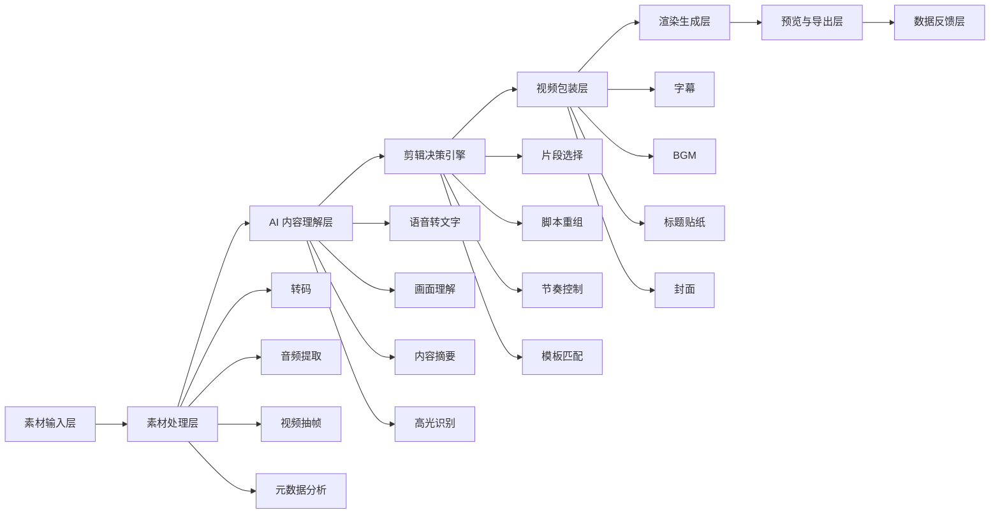
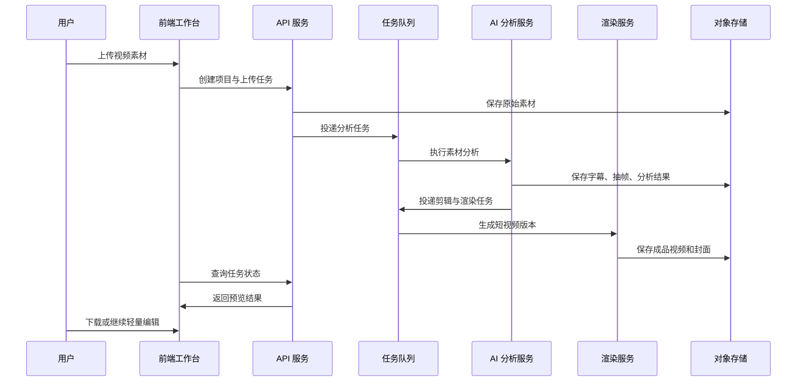
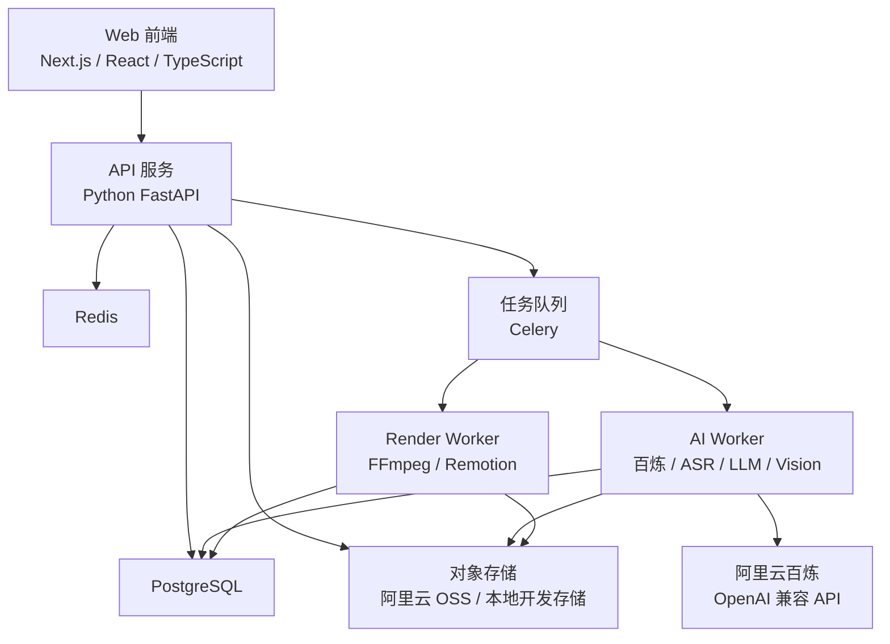
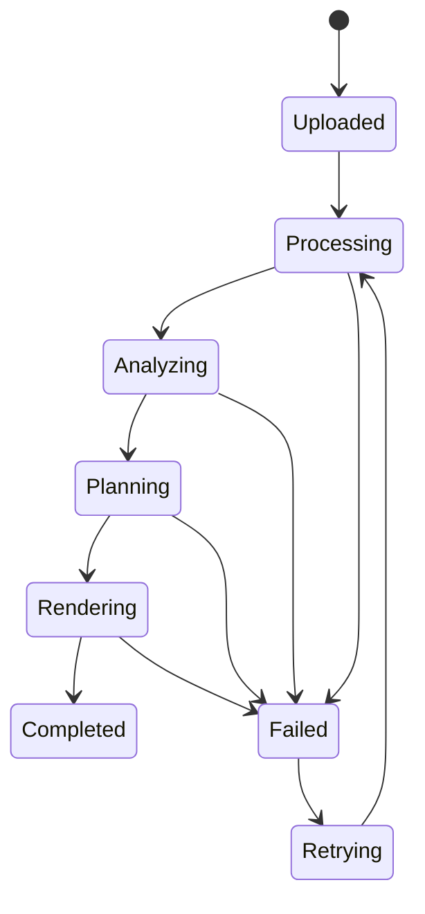

# ClipSpark AI 架构设计文档

## 1. 产品定位

ClipSpark AI 是一个 AI 短视频剪辑工具，目标是让用户上传原始素材后，一键生成可以直接发布到短视频平台的成品视频。

产品核心不是传统时间轴剪辑器，而是一个 AI 视频生产流水线：

1. 理解素材内容。
2. 识别适合传播的高光片段。
3. 自动生成剪辑方案。
4. 自动完成字幕、标题、封面、BGM、转场等包装。
5. 导出适配平台发布的视频。

第一阶段建议聚焦一个清晰场景：

> 上传一段长视频，AI 自动剪出 3 条可发布短视频。

## 2. 总体架构



## 3. 核心业务流程



## 4. 模块设计

### 4.1 素材输入层

负责接收用户上传的素材，并保存为后续 AI 分析和渲染可使用的资源。

支持类型：

- 长视频
- 多段短视频
- 图片
- 音频
- 文案
- 商品链接或外部素材链接

关键能力：

- 分片上传
- 断点续传
- 文件格式校验
- 素材元数据读取
- 原始素材归档
- 上传进度展示

### 4.2 素材处理层

负责把原始素材处理成 AI 和渲染服务可消费的标准化中间产物。

处理内容：

- 视频转码
- 音频提取
- 静音片段检测
- 视频抽帧
- 分辨率、帧率、时长分析
- 画面比例识别
- 音量标准化

推荐技术：

- FFmpeg
- MediaInfo
- 对象存储临时文件缓存

### 4.3 AI 内容理解层

这是系统的大脑，负责把视频从“媒体文件”转换为结构化内容数据。

核心能力：

- ASR：语音转文字，生成带时间戳字幕。
- OCR：识别画面中文字。
- 视觉理解：识别人脸、场景、商品、动作、画面质量。
- 内容摘要：生成视频主题、段落结构和关键词。
- 高光识别：找出适合剪成短视频的片段。
- 风格判断：识别口播、探店、带货、教程、Vlog、访谈等内容类型。

示例输出：

```json
{
  "topic": "AI 剪辑工具介绍",
  "duration": 486.2,
  "content_type": "口播教程",
  "keywords": ["一键剪辑", "自动字幕", "短视频"],
  "highlights": [
    {
      "start": 12.3,
      "end": 39.8,
      "score": 0.91,
      "reason": "开头有明确痛点和产品卖点，适合作为短视频开场"
    }
  ],
  "recommended_styles": ["抖音口播", "小红书种草"]
}
```

### 4.4 剪辑决策引擎

负责把 AI 分析结果转化为具体剪辑方案。它相当于系统里的“AI 导演”。

决策内容：

- 选择哪些片段。
- 片段如何排序。
- 前 3 秒如何制造钩子。
- 是否删除停顿、口癖、重复表达。
- 是否补充标题、字幕高亮、转场、音效。
- 生成几个不同版本。
- 适配哪个平台比例和时长。

剪辑方案建议用结构化数据保存，方便预览、编辑和重新渲染。

```json
{
  "version": "v1",
  "target_platform": "douyin",
  "aspect_ratio": "9:16",
  "duration_target": 45,
  "clips": [
    {
      "source_asset_id": "asset_001",
      "source_start": 12.3,
      "source_end": 28.7,
      "timeline_start": 0,
      "timeline_end": 16.4
    }
  ],
  "subtitle_style": "large_keyword_highlight",
  "bgm_style": "light_trend",
  "cover_strategy": "best_face_and_title"
}
```

### 4.5 模板与包装层

模板不应该只是视觉样式，还应该包含剪辑策略。

模板内容：

- 视频比例
- 目标时长
- 开场策略
- 字幕样式
- 标题样式
- BGM 风格
- 转场规则
- 关键词高亮规则
- 封面布局
- 结尾 CTA

示例：

```json
{
  "name": "抖音口播爆款模板",
  "platform": "douyin",
  "aspect_ratio": "9:16",
  "duration_range": [30, 60],
  "hook_strategy": "pain_point_first",
  "pace": "fast",
  "subtitle_style": "large_keyword_highlight",
  "bgm": "light_trend",
  "ending": "soft_cta"
}
```

### 4.6 渲染生成层

负责根据剪辑方案生成最终视频文件。

核心能力：

- 视频裁剪与拼接
- 字幕烧录
- BGM 和音效混合
- 音量均衡
- 转场合成
- 封面生成
- 多比例导出
- 多版本并行生成

建议采用异步任务架构，避免长时间渲染阻塞 API 请求。

推荐技术：

- FFmpeg：稳定、成熟，适合服务端批量处理。
- Remotion：适合用 React 方式描述复杂视频模板。
- 队列系统：BullMQ、Celery、Temporal。

### 4.7 用户工作台

用户工作台要围绕“一键生成 + 轻量调整”设计，不建议第一版做完整专业时间轴。

核心页面：

- 素材上传页
- 生成配置页
- AI 结果页
- 视频预览页
- 轻量编辑页
- 草稿箱
- 模板库

轻量编辑能力：

- 替换片段
- 调整字幕文本
- 更换字幕样式
- 更换 BGM
- 修改封面
- 修改标题文案
- 切换比例
- 重新生成

### 4.8 发布与导出层

第一阶段可以先支持下载，后续再逐步接入平台发布能力。

导出内容：

- MP4 成品视频
- 封面图
- 标题
- 发布文案
- 话题标签
- 字幕文件

平台适配：

- 抖音
- 快手
- 小红书
- 视频号
- TikTok
- YouTube Shorts

### 4.9 数据反馈层

数据反馈用于持续优化 AI 剪辑质量。

需要记录：

- 用户选择了哪个版本。
- 用户删除了哪些片段。
- 用户修改了哪些字幕。
- 哪些模板生成率高。
- 哪些视频被下载或发布。
- 成品视频的播放、点赞、评论、转化数据。

反馈用途：

- 优化高光识别。
- 优化模板推荐。
- 优化标题和封面生成。
- 优化不同行业的视频节奏。

## 5. 推荐技术架构



### 前端

推荐：

- Next.js / React
- TypeScript
- Tailwind CSS
- Zustand 或 Redux
- TanStack Query
- 分片上传组件
- 视频预览组件

重点：

- 上传体验稳定。
- 任务状态清晰。
- 预览和下载路径短。
- 轻量编辑能力克制但实用。

### 后端

推荐：

- API 服务：Python FastAPI。
- AI 编排：Python Service + Celery Worker。
- 渲染服务：独立 Worker。
- 数据库：PostgreSQL。
- 缓存与任务状态：Redis。
- 对象存储：本地开发目录 + 生产阿里云 OSS。

### AI 能力

可拆分为以下服务：

- 百炼 Provider：统一封装 OpenAI 兼容 API 调用。
- ASR 服务：语音转文字。
- Vision 服务：抽帧理解、画面质量分析。
- LLM 服务：摘要、标题、标签、剪辑决策。
- Embedding 服务：素材检索、片段相似度、模板匹配。

### 视频处理

推荐：

- FFmpeg 用于转码、裁剪、拼接、音频处理。
- Remotion 用于复杂模板渲染和字幕动画。
- Worker 池用于并发渲染。

## 6. 数据模型草案

### User

- id
- name
- email
- plan
- created_at

### Project

- id
- user_id
- name
- status
- created_at
- updated_at

### Asset

- id
- project_id
- type
- original_url
- processed_url
- duration
- width
- height
- fps
- metadata
- created_at

### AnalysisResult

- id
- project_id
- asset_id
- transcript
- scenes
- highlights
- keywords
- summary
- created_at

### EditPlan

- id
- project_id
- template_id
- target_platform
- aspect_ratio
- duration
- clips
- subtitle_config
- audio_config
- cover_config
- status
- created_at

### RenderJob

- id
- project_id
- edit_plan_id
- status
- progress
- error_message
- output_video_url
- output_cover_url
- created_at
- updated_at

### Template

- id
- name
- platform
- content_type
- config
- status
- created_at

## 7. 任务状态机



状态说明：

- Uploaded：素材已上传。
- Processing：素材处理中。
- Analyzing：AI 内容分析中。
- Planning：生成剪辑方案中。
- Rendering：渲染成品视频中。
- Completed：生成完成。
- Failed：任务失败。
- Retrying：重试中。

## 8. MVP 建设路线

### 阶段一：最小可用闭环

目标：证明“上传长视频，自动生成短视频”成立。

范围：

- 上传一个视频。
- 提取音频。
- ASR 生成字幕。
- AI 找出 3 个高光片段。
- 自动生成 3 个 9:16 短视频。
- 自动添加字幕和简单标题。
- 导出 MP4。

不做：

- 完整时间轴编辑器。
- 多平台自动发布。
- 复杂素材库。
- 团队协作。

### 阶段二：可用性增强

范围：

- 多模板选择。
- 字幕样式切换。
- BGM 自动匹配。
- 封面自动生成。
- 用户可轻量修改字幕和标题。
- 支持重新生成。

### 阶段三：平台化能力

范围：

- 多平台比例与规则适配。
- 批量生成。
- 素材库。
- 品牌模板。
- 账号内容风格学习。
- 数据反馈优化。

### 阶段四：商业化增强

范围：

- 团队空间。
- 权限管理。
- 会员套餐。
- 渲染额度。
- 品牌资产库。
- API 能力。

## 9. 关键风险与建议

### AI 剪辑质量不可控

建议：

- 第一版聚焦口播、访谈、教程等结构清晰的视频。
- 高光识别给出多个版本，降低单次判断失败风险。
- 保留轻量编辑能力，让用户能快速修正。

### 渲染耗时较长

建议：

- 全部渲染任务异步化。
- 提供明确进度。
- 使用 Worker 池横向扩展。
- 对常用模板做缓存和预处理。

### 成本容易失控

建议：

- 抽帧频率按视频类型动态调整。
- 长视频先做粗分析，再做重点片段精分析。
- 对 ASR、视觉理解、LLM 调用做缓存。
- 用户套餐绑定渲染时长和 AI 分析额度。

### 产品容易变成复杂剪辑器

建议：

- 第一优先级永远是一键生成。
- 编辑能力只服务于修正 AI 结果。
- 不在 MVP 阶段做专业时间轴。

## 10. 成功指标

产品指标：

- 上传到生成完成的成功率。
- 首条视频生成耗时。
- 用户下载率。
- 用户选择 AI 推荐版本的比例。
- 用户重新生成次数。
- 字幕修改率。
- 模板使用率。

内容指标：

- 平均完播率。
- 点赞率。
- 评论率。
- 转发率。
- 转化率。

系统指标：

- 分析任务平均耗时。
- 渲染任务平均耗时。
- 渲染失败率。
- AI 调用成本。
- 单视频平均生成成本。

## 11. 总结

ClipSpark AI 的核心架构应围绕 AI 自动生产短视频展开，而不是复刻传统剪辑软件。

最重要的技术主线是：

1. 素材标准化处理。
2. AI 内容理解。
3. 结构化剪辑决策。
4. 模板化视频包装。
5. 异步渲染生成。
6. 数据反馈优化。

MVP 应该先把“上传长视频，自动生成 3 条可发布短视频”做到稳定、快速、可预览、可下载。只要这个闭环成立，后续再扩展模板、平台适配、自动发布和商业化能力。
